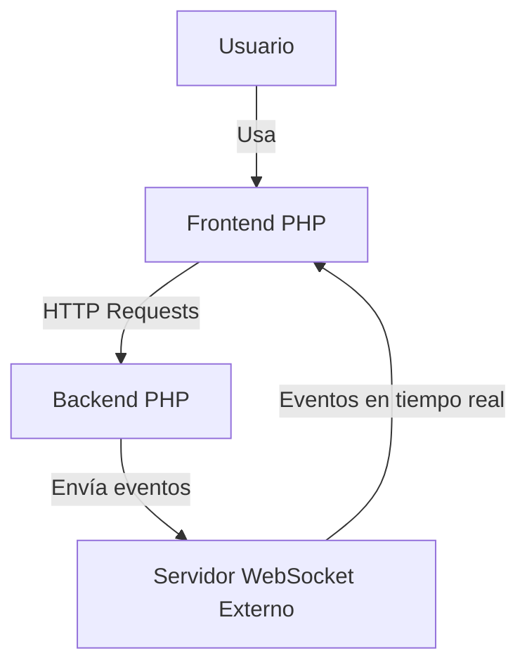
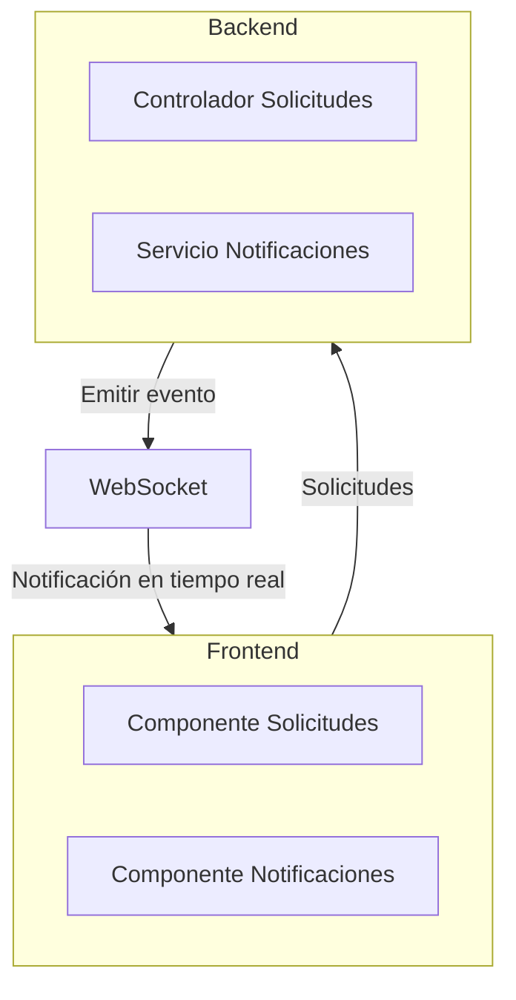

# Modelo C4 - Sistema Web con Notificaciones en Tiempo Real

Este documento muestra un **modelo C4 simplificado** de un sistema web con backend y frontend en PHP y notificaciones en tiempo real usando un **WebSocket externo** (como Pusher o Ably).

---

## 1️⃣ Nivel de Sistema (Context)

